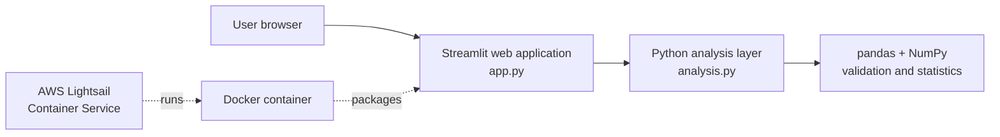

# Evaluation Data Inspector

**Evaluation Data Inspector is an end-to-end cloud-deployable evaluation and data-analysis application built with Python.** It turns a CSV into a concise quality and descriptive-analysis report, giving evaluators an immediate view of structure, completeness, distributions, and group differences before deeper analysis.

This portfolio project demonstrates a deliberately small production path: testable statistical logic, a usable Streamlit interface, a reproducible Docker image, and an AWS Lightsail Container Service deployment target. It does not claim to replace a full statistical package or a formal impact evaluation.

## Features

- Upload and validate a UTF-8 CSV, or explore the included synthetic educational evaluation data.
- Review row/column counts, variable names, inferred types, missing counts, duplicates, and a preview.
- Calculate N, mean, sample standard deviation, minimum, and maximum for numeric variables.
- Inspect missingness in a table and chart.
- Choose a numeric outcome and an optional categorical grouping variable.
- Compare descriptive statistics across groups.
- Calculate the group-mean difference and pooled-SD Cohen's d when exactly two valid groups exist.
- Visualise outcome distributions, missingness, and group means with Streamlit-native charts.
- Process uploads in memory without intentionally persisting them.

## Architecture



`app.py` owns presentation and application flow. `analysis.py` contains reusable, independently tested validation and statistical functions. There is no database, API tier, authentication service, or uploaded-data storage.

## Technology stack

- Python 3.12
- Streamlit
- pandas and NumPy
- pytest
- Docker
- AWS Lightsail Container Service (deployment target)

## Project structure

```text
evaluation-data-inspector/
├── .streamlit/config.toml
├── app.py
├── analysis.py
├── sample_data/sample_evaluation_data.csv
├── tests/test_analysis.py
├── requirements.txt
├── requirements-dev.txt
├── Dockerfile
├── .dockerignore
├── .gitignore
├── README.md
└── DEPLOYMENT.md
```

## Local setup

Python 3.12 is recommended.

```bash
git clone <repository-url>
cd evaluation-data-inspector
python3 -m venv .venv
source .venv/bin/activate
python -m pip install --upgrade pip
python -m pip install -r requirements-dev.txt
streamlit run app.py
```

Open `http://localhost:8501`. The synthetic sample is selected initially. To test an upload, choose **Upload CSV** in the sidebar and select a UTF-8 `.csv` file with a header row.

The demo accepts at most 10 MB, 100,000 rows, and 250 columns. These are application guardrails, not analytical limits of pandas.

## Testing

```bash
pytest -q
```

The suite covers dataset summaries, numeric and grouped statistics, missingness, Cohen's d, CSV parsing, and malformed or analytically invalid inputs.

## Docker

```bash
docker build -t evaluation-data-inspector:latest .
docker run --rm -p 8501:8501 --name evaluation-data-inspector evaluation-data-inspector:latest
```

Then visit `http://localhost:8501` or check the health endpoint:

```bash
curl --fail http://localhost:8501/_stcore/health
```

The image is based on `python:3.12-slim`, runs as an unprivileged user, and includes a container health check.

At the time of this repository's final local QA, the available environment did not have a `docker` executable in `PATH`. The Dockerfile and commands are complete, but the image build, container run, and container health request remain to be executed on a Docker-equipped host; they are not represented as having passed.

## Cloud deployment

The intended public deployment is the smallest AWS Lightsail Container Service tier (`nano`, scale 1). See [DEPLOYMENT.md](DEPLOYMENT.md) for prerequisites, exact commands, health verification, updates, and cleanup. AWS charges can apply while the service exists. Deployment has not been claimed: the final QA environment did not include the AWS CLI, so it could not establish an AWS identity or region.

## Privacy and security

Uploaded CSV content is passed directly from Streamlit's upload object to pandas in memory. The application does not write it to local storage, a database, object storage, logs, or analytics. Data can nevertheless remain in process memory for the active Streamlit session; users should treat this as a demonstration rather than an approved environment for sensitive research data.

The repository contains only deterministic, synthetic data. Secrets, environment files, private keys, and Streamlit secrets are excluded by `.gitignore`.

## Statistical notes and limitations

- Results are descriptive, not causal or inferential.
- Missing values are removed analysis-by-analysis (complete cases for the chosen outcome and group).
- Cohen's d uses the conventional pooled sample standard deviation and requires exactly two groups, at least two valid observations per group, and non-zero pooled variance.
- The sign of the mean difference and d is based on the groups' first appearance in the data and is explicitly labelled in the interface.
- Data types are inferred by pandas; dates and numeric values stored as text may need preprocessing.
- The app does not apply survey weights, clustered designs, imputation, confidence intervals, or multiple-testing corrections.
- Grouping choices are limited to columns with 2–20 observed values to keep the demo readable.
- A single Streamlit process is suitable for a portfolio demo, not high-concurrency or regulated workloads.

## Possible future extensions

- Configurable value-range and schema checks for evaluation instruments.
- Confidence intervals and robust effect-size alternatives.
- Pre/post change scores and paired analyses.
- Exportable, disclosure-checked summary reports.
- Automated accessibility checks and browser-level regression tests.
- A managed, authenticated deployment designed for approved sensitive-data workflows.
